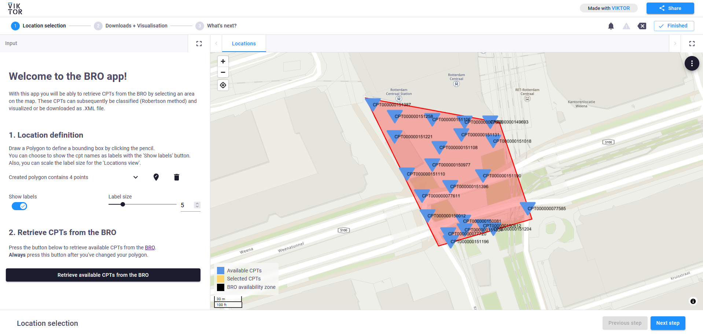
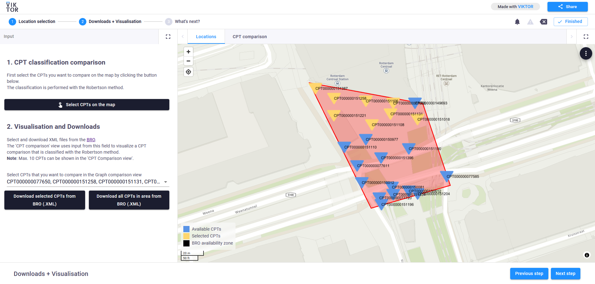
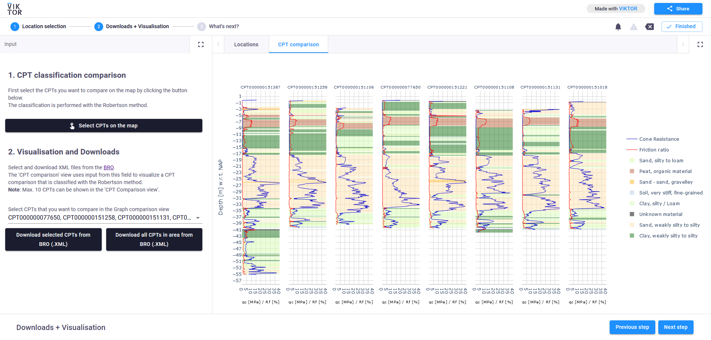

 <Please check version is the same as specified in requirements.txt>

# BRO app

This sample app demonstrates how the bro package can be used in VIKTOR to retrieve and classify CPTs from the BRO with the Robertson method.

The goal of this app is to easily query the BRO REST API and classify the desired CPTs within your region of interest.

The following functionalities are demonstrated:

- Usage of the bro package
- Step validation
- Usage of interaction groups in a MapView
- CPT classification with the Robertson method
- Download the retrieved CPT files

A published version of this app is available on [demo.viktor.ai](https://demo.viktor.ai/public/bro-app).

## Steps

### Step 1: Location selection

1. Draw a polygon within the NL boundaries to retrieve available CPTs in the BRO.
2. After drawing a polygon, or editing it, make sure you (re)press the button 'Retrieve available CPTs from the BRO'. You can choose to show the labels or not, if so you can also set the label size.

After pressing the 'Next step' button, a simple check is performed to see whether the retrieved data is up-to-date with the parameters.

### Step 2: Downloads + Visualisation

1. Select up to 10 CPTs in the map to be classified with the Robertson method. The classification can be seen in the CPT comparison view.

2. After selecting CPTs on the map, the options in this part are set with these CPTs. You can choose to download these CPTs as XML file, or you can choose to download all available CPTs within your region of interest.

## App structure 
This is an editor-only app type.
